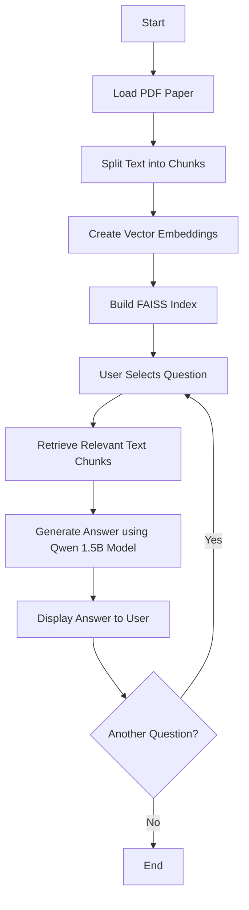

## Overview
```markdown
## RAG System for Paper Analysis Flow Chart


```
This project implements a Retrieval-Augmented Generation (RAG) system for analyzing research papers. It uses a local language model to extract key information from a given PDF paper based on predefined questions. The tool leverages various components from the LangChain library to create an efficient document processing and question-answering pipeline.

## Features

- PDF loading and text splitting
- Vector embedding using HuggingFace models
- Efficient similarity search with FAISS
- Local language model integration (Qwen 1.5B)
- Predefined questions for structured paper analysis

## Prerequisites

- Python 3.8+
- pip (Python package manager)

## Installation

1. Clone the repository:
   ```
   git clone [The Repo-Link]
   cd [The Directory]
   ```

2. Install the required packages:
   ```
   pip install langchain langchain_community langchain_text_splitters faiss-cpu sentence-transformers pypdf
   ```

3. Install the Ollama package and download the Qwen 1.5B model:
   ```
   # Install Ollama (instructions may vary based on your OS)
   curl https://ollama.ai/install.sh | sh
   
   # Pull the Qwen 1.5B model
   ollama pull qwen2:1.5b
   ```

## Usage

1. Place your research paper (in PDF format) in the project directory and name it `paper.pdf`.

2. Run the script:
   ```
   python rag_paper_analysis.py
   ```

3. You will be presented with 5 predefined questions. Enter the number corresponding to the question you want to ask about the paper.

4. The system will process the question and provide a response based on the content of the paper.

## How it Works

1. **PDF Processing**: The tool loads the PDF and splits it into manageable chunks.
2. **Embedding**: Text chunks are converted into vector embeddings using a HuggingFace model.
3. **Indexing**: FAISS is used to create a searchable index of these embeddings.
4. **Question Processing**: When a question is selected, the system retrieves relevant text chunks.
5. **Answer Generation**: The local Qwen 1.5B model generates an answer based on the retrieved context and the question.

## Predefined Questions

1. What are the main findings of this paper?
2. Summarize the methodology used in this research.
3. What are the key contributions of this paper to the field?
4. What are the limitations of this study?
5. What future research directions are suggested by this paper?

## Customization

You can modify the `questions` list in the script to add or change the predefined questions according to your needs.

## Limitations

- The accuracy of the analysis depends on the quality and relevance of the input PDF.
- The local language model (Qwen 1.5B) may have limitations compared to larger, more advanced models.

## Contributing

Contributions to improve the tool are welcome. Please feel free to submit issues or pull requests.

